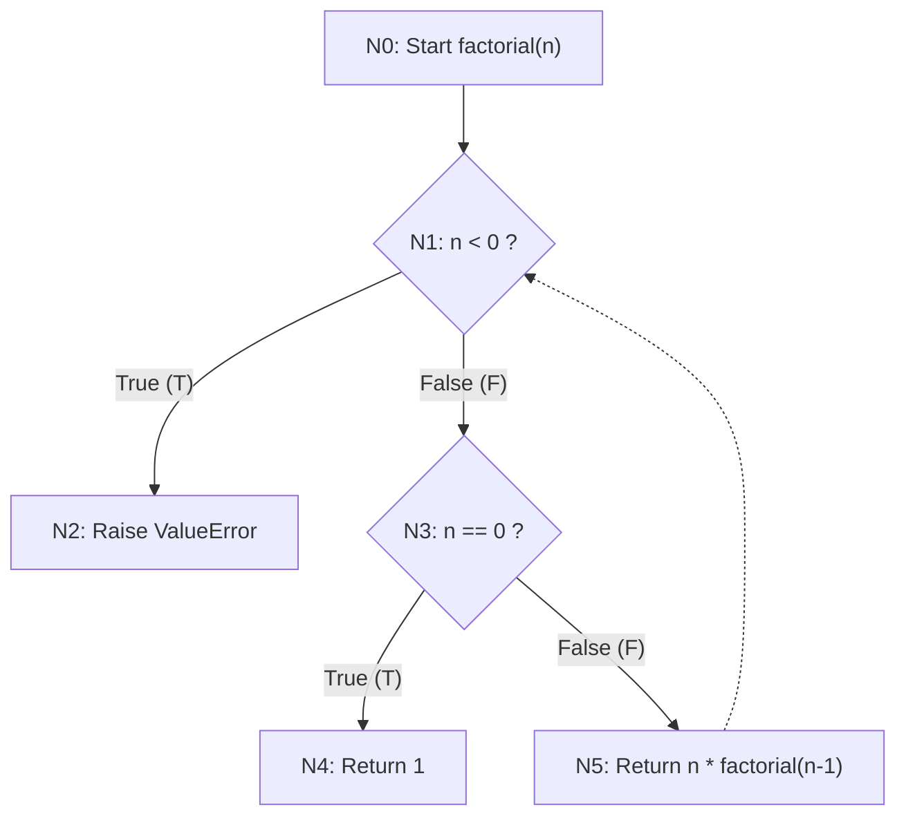

# Control Flow Graph for `factorial(n)`

Below is the Mermaid CFG showing the 3 linearly independent paths through the factorial function.

## Mermaid CFG Diagram



## Graph Metrics

| Symbol | Meaning | Value |
|--------|---------|-------|
| **E**  | Edges   | 7     |
| **N**  | Nodes   | 6     |
| **P**  | Connected Components | 1 |

## Cyclomatic Complexity Calculation

**Formula:** `C = E - N + 2P`

```
C = 7 - 6 + 2(1)
C = 1 + 2
C = 3
```

## Linearly Independent Paths

There are **3 linearly independent paths** (C = 3):

### Path 1: Negative input (Error path)
```
N0 → N1(T) → N2
```
- **Input:** `n < 0` (e.g., `-1`)
- **Expected:** `ValueError`
- **Nodes covered:** N0, N1(T), N2

### Path 2: Zero input (Base case)
```
N0 → N1(F) → N3(T) → N4
```
- **Input:** `n = 0`
- **Expected:** `1`
- **Nodes covered:** N0, N1(F), N3(T), N4

### Path 3: Positive input (Recursive case)
```
N0 → N1(F) → N3(F) → N5 → (recurses back to N1)
```
- **Input:** `n > 0` (e.g., `5`)
- **Expected:** `n!` (factorial result)
- **Nodes covered:** N0, N1(F), N3(F), N5 (then N1 recursively)
