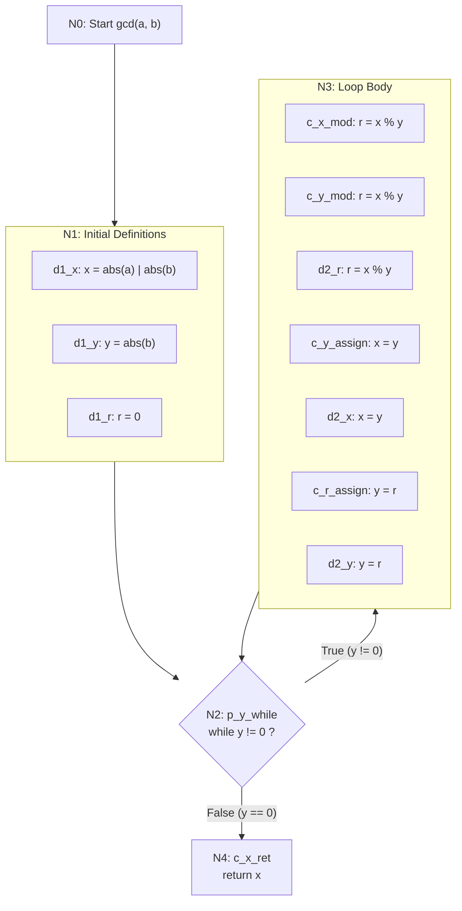

# Data Flow Diagram for `gcd(x, y, r)`

Below is the Mermaid diagram showing definition (d), computation-use (c-use),
and predicate-use (p-use) points for all three variables in the GCD function.

## Mermaid DU Diagram

## Variable Analysis

### Variable `x`

| Point | Type | Location | Description |
|-------|------|----------|-------------|
| d1_x | def | N1 | `x = abs(a) if a != 0 else abs(b)` |
| d2_x | def | N3 | `x = y` (loop body assignment) |
| c_x_mod | c-use | N3 | `r = x % y` — uses x in modulo |
| c_x_ret | c-use | N4 | `return x` — uses x as return value |

### Variable `y`

| Point | Type | Location | Description |
|-------|------|----------|-------------|
| d1_y | def | N1 | `y = abs(b)` |
| d2_y | def | N3 | `y = r` (loop body assignment) |
| c_y_mod | c-use | N3 | `r = x % y` — uses y in modulo |
| c_y_assign | c-use | N3 | `x = y` — uses y in assignment |
| p_y_while | p-use | N2 | `while y != 0` — uses y in predicate |

### Variable `r`

| Point | Type | Location | Description |
|-------|------|----------|-------------|
| d1_r | def | N1 | `r = 0` (initialization) |
| d2_r | def | N3 | `r = x % y` (computed remainder) |
| c_r_assign | c-use | N3 | `y = r` — uses r in assignment |

## DU Pairs Summary

| Variable | DU Pairs | Uses |
|----------|----------|------|
| x | (d1_x, c_x_mod), (d1_x, c_x_ret), (d2_x, c_x_mod), (d2_x, c_x_ret) | 2 defs × 2 uses = 4 |
| y | (d1_y, c_y_mod), (d1_y, c_y_assign), (d1_y, p_y_while), (d2_y, c_y_mod), (d2_y, c_y_assign), (d2_y, p_y_while) | 2 defs × 3 uses = 6 |
| r | (d1_r, c_r_assign), (d2_r, c_r_assign) | 2 defs × 1 use = 2 |
| **Total** | **12 DU pairs** | |
